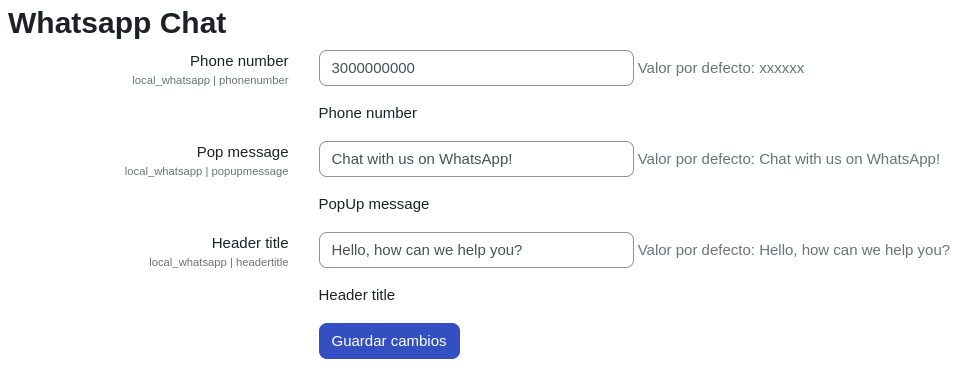
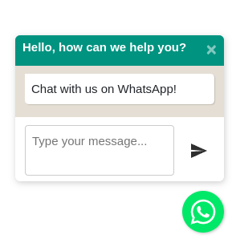

# Whatsapp Chat #

Este plugin permite a los usuarios de Moodle enviar mensajes de texto a través de Whatsapp.

## Instalación mediante archivo ZIP cargado ##

1. Inicia sesión en tu sitio Moodle como administrador y ve a `Administración del sitio > Plugins > Instalar plugins`.
2. Sube el archivo ZIP con el código del plugin. Solo deberías recibir una solicitud para agregar detalles adicionales si el tipo de plugin no se detecta automáticamente.
3. Verifica el informe de validación del plugin y finaliza la instalación.

## Instalación manual ##

El plugin también se puede instalar colocando el contenido de este directorio en

    {tu/ruta/moodle}/local/whatsapp

## Configuración ##

1. Acceder a `Administración del sitio > Extensiones locales > Whatsapp Chat`
   
   Llenar los campos con la informacion correspondiente.

   

## Previsualización ##

1. En la parte inferior izquierda dar click en le boton flotante con el icono de WhatsApp
   
   

2. Deberá aparecer un modal como el siguiente desde el cual se podrá enviar un mensaje al numero registrado en la configuracion del plugin
   
   