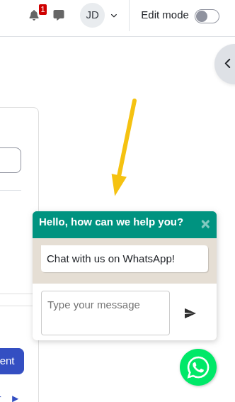

# WhatsApp Chat Plugin for Moodle

A Moodle local plugin that adds a floating WhatsApp chat button to your Moodle site.

This plugin allows users to easily contact you via WhatsApp directly from any Moodle page through a floating chat button. It provides customizable messaging options.

## Features

- **Floating Chat Button**: Displays a WhatsApp icon button that floats on the bottom corner of Moodle pages
- **Customizable Position**: Choose between left or right side positioning
- **Configurable Phone Number**: Set the destination phone number with country code
- **Customizable Messages**: Configure popup message and header title
- **Multi-language Support**: Available in English and Spanish
- **Privacy Compliant**: Does not store any personal user data
- **Responsive Design**: Works seamlessly across all devices and screen sizes

## Requirements

- Moodle 4.1 or higher

## Configuration

After installation, configure the plugin through Moodle's administration interface:

1. Navigate to `Site administration > Plugins > Local plugins > WhatsApp Chat`

   

2. Configure the following settings:
   - **Show WhatsApp button**: Enable or disable the floating chat button (default: enabled)
   - **Phone number**: Enter the destination phone number including country code (e.g., +1234567890)
   - **Popup message**: Customize the message displayed in the floating button
   - **Header title**: Set the title shown in the chat window header
   - **Position**: Choose between `Left` or `Right` side positioning

    

## Usage

Once configured, users will see a floating WhatsApp button on all Moodle pages.

If the position is set to `Left`, the button will be displayed on the bottom left side of the page. 

If set to `Right`, it will appear on the bottom right side of the page.

When the button is clicked:

1. A chat popup window opens with your configured header title
2. Users can type their message in the provided text input
3. Clicking "Send" opens WhatsApp with a pre-filled message to your configured phone number

The plugin enhances user engagement by providing an immediate communication channel for support inquiries, feedback, or general questions.

## Installing via uploaded ZIP file ##

1. Log in to your Moodle site as an admin and go to _Site administration >
   Plugins > Install plugins_.
2. Upload the ZIP file with the plugin code. You should only be prompted to add
   extra details if your plugin type is not automatically detected.
3. Check the plugin validation report and finish the installation.

## Installing manually ##

The plugin can be also installed by putting the contents of this directory to

    {your/moodle/dirroot}/local/whatsapp

Afterwards, log in to your Moodle site as an admin and go to _Site administration >
Notifications_ to complete the installation.

Alternatively, you can run

    $ php admin/cli/upgrade.php

to complete the installation from the command line.

## License ##

2025 Buenda Data <https://buendata.com>

This program is free software: you can redistribute it and/or modify it under
the terms of the GNU General Public License as published by the Free Software
Foundation, either version 3 of the License, or (at your option) any later
version.

This program is distributed in the hope that it will be useful, but WITHOUT ANY
WARRANTY; without even the implied warranty of MERCHANTABILITY or FITNESS FOR A
PARTICULAR PURPOSE.  See the GNU General Public License for more details.

You should have received a copy of the GNU General Public License along with
this program.  If not, see <https://www.gnu.org/licenses/>.
